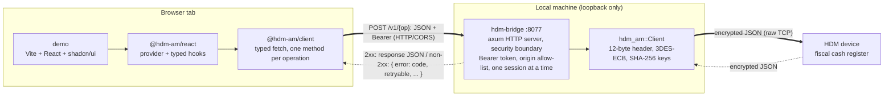

# hdm-am

A Rust client for the Armenian fiscal cash register protocol — the spec published by the State Revenue Committee of Armenia (ՊԵԿ) for integrating external (commercial) software with fiscal cash registers (Հսկիչ Դրամարկղային Մեքենա — **HDM**, ՀԴՄ).

The workspace contains four crates:

- **`hdm-am`** — the library: wire framing, encryption, and one typed request/response per operation.
- **`hdm-am-cli`** — a thin command-line tool (binary `hdm`) that maps subcommands onto the library.
- **`hdm-am-app`** — a native Slint GUI application (binary `hdm-app`) with desktop entrypoint now
  and mobile packaging scaffolds for Android/iOS.
- **`hdm-am-bridge`** — a localhost HTTP server (binary `hdm-bridge`) that exposes the protocol to a
  browser over CORS, since a browser cannot open a raw TCP socket. See [HTTP bridge](#http-bridge).

## Scope

The crate speaks the HDM TCP protocol directly:

- 12-byte fixed header with `D5 80 D4 B4 D5 84` magic ("ՀԴՄ" in UTF-8), 2-byte protocol version, 1-byte operation code, 2-byte big-endian payload length.
- 3DES-ECB-PKCS7-encrypted JSON payloads.
- Two-key model: a SHA-256-derived password key for operator login (and the operator/department listing), a session key returned by login for everything after.
- All 16 operations from spec v0.7.3.

It does **not** handle the surrounding business logic — selecting an HDM device, persisting fiscal receipts, deciding what to print. That belongs to the consumer.

## Operation coverage

All 16 operations are implemented and unit-tested. Hardware behaviour is recorded **per device and firmware** below — the protocol is the same across terminals, but what a given firmware actually does (logo rendering, returns, eMark validation) varies, so the status column is firmware-specific.

### Tested devices

| Device | OS / build | Firmware | HDM protocol / software |
|---|---|---|---|
| Newland N950 | Android 6 / Android 12 (`SKQ1.220119.001`) | `D_03_51_00_01010000` | `0.7` / `1.1.0` |

The device reports protocol version `0.7` (matching spec v0.7.x) in its responses, yet accepts the `0.5`-framed requests this crate sends — the request framing version (`05`, fixed by the spec) and the device's reported response version legitimately differ.

### Per-operation status

Each row is keyed by the protocol operation code (the byte sent on the wire, 1–16) and its function name.

| Code | Function | Newland N950 (`D_03_51_00_01010000`) |
|---:|---|---|
| 1 | List operators & departments | OK |
| 2 | Operator login | OK |
| 3 | Operator logout | OK |
| 4 | Print receipt | OK — registered a real fiscal sale |
| 5 | Reprint last receipt | OK |
| 6 | Print return | Needs re-test — previously exercised with codes 6/10 swapped [1] |
| 7 | Header / footer config | OK |
| 8 | Header logo | Accepted (`200`) but not rendered [2] |
| 9 | Fiscal report (X / Z) | OK — both; a Z-report does not lock the device [3] |
| 10 | Get returnable receipt (lookup) | Needs re-test — previously exercised with codes 6/10 swapped [1] |
| 11 | Cash in / out | OK — both directions |
| 12 | Date / time | OK |
| 13 | Receipt sample | OK |
| 14 | Time sync | OK |
| 15 | Payment systems list | OK |
| 16 | Single eMark | Error path only [4] |

**Notes:**

1. **Returns** (*print return*, op 6, and *get returnable receipt*, op 10). These tests were captured while the crate had operation codes 6 and 10 **swapped** relative to the spec's operation-codes table (§4.4.1) — so the recorded responses (`503` for the lookup, `174` for the return) were obtained by sending each request to the *wrong* op code and **do not characterise the corrected operations**; both rows need re-testing on hardware. What still holds independently of the code mix-up: returns key on a `Receipt_ID` that lives only in the receipt-print response's `qr` field, and this firmware omits `qr` entirely (confirmed on the raw decrypted payload, not just `null`), so a real `Receipt_ID` likely has to come out-of-band. The lookup response shape (`ReturnableReceiptResponse`) is modelled from the spec alone and remains **unverified** — see its doc comment.
2. **Header logo.** The protocol accepts a Base64 BMP and returns success, but no custom logo prints (tried 1-bit BMP/PNG at 384×4 and 384×64). The firmware appears to ignore custom header logos.
3. **Z-report.** Verified that a Z-report closes the fiscal shift without locking the device — the next receipt opens a new fiscal day.
4. **Single eMark.** Only the error path is verified: malformed codes return `195`. The success path needs a real, registered GS1 Data Matrix code from a marked product.

Behaviour on other models or firmware versions is unknown — additions to this table are welcome.

## Library usage

```rust
use std::net::TcpStream;
use std::time::Duration;
use hdm_am::{Client, InMemorySeq, PrintReceiptRequest, PrintMode, Decimal};

let tcp = TcpStream::connect("10.0.0.5:1025")?;
tcp.set_read_timeout(Some(Duration::from_secs(50)))?;
let mut client = Client::new(tcp, "<hdm-password>", InMemorySeq::default());

client.login(3, "1234")?;                 // cashier id + PIN
let receipt = client.print_receipt(PrintReceiptRequest {
    mode: PrintMode::Simple,
    paid_amount: Decimal::new(1000, 2),   // 10.00 cash
    paid_amount_card: Decimal::ZERO,
    partial_amount: Decimal::ZERO,
    pre_payment_amount: Decimal::ZERO,
    dep: Some(1),
    partner_tin: None,
    use_ext_pos: false,
    payment_system: None,
    rrn: None,
    terminal_id: None,
    e_marks: vec![],
    items: vec![],
})?;
println!("fiscal #{} (seq {})", receipt.fiscal, receipt.rseq);
client.logout()?;
```

All monetary and quantity fields use `rust_decimal::Decimal` (re-exported as `hdm_am::Decimal`); the wire encoding stays a JSON number.

## CLI usage

Connection parameters come from flags or the `HDM_*` environment variables. The CLI exposes all 16
protocol operations; run `hdm --help` or `hdm <command> --help` for the full argument surface.

```sh
export HDM_HOST=10.0.0.5 HDM_PORT=1025 HDM_PASSWORD=<hdm-password> HDM_CASHIER=3 HDM_PIN=1234

hdm operators                                        # list operators & departments (no login)
hdm receipt --mode simple --cash 10 --dep 1          # print a fiscal receipt (prompts first)
hdm receipt --mode products --card 10 --items items.json --use-ext-pos --rrn 123456789012 --terminal-id 12345678 --emark <code>
hdm report --kind x                                  # interim X-report
hdm report --kind x --transaction-type 1             # X-report filtered by transaction type
hdm lookup-receipt --receipt-id 123 --crn 51815332   # read-only receipt lookup
hdm return --crn 51815332 --ticket 123 --return-items return-items.json --emark <code>
hdm --json datetime                                  # machine-readable output to stdout
```

`receipt --items` expects a JSON array of `ReceiptItem` objects. `return --return-items` expects a
JSON array like `[{"rpid":100,"quantity":1}]`, using the item row IDs returned by
`lookup-receipt`.

Irreversible operations (receipt, return, cash, Z-report) prompt for confirmation unless `--yes` is passed. `-v`/`-vv` raise log verbosity (logs go to stderr; `-vv` traces the raw decrypted payloads).

## GUI app

The native GUI lives in [`crates/hdm-am-app/`](crates/hdm-am-app/) and uses Slint without a webview. It has buttons for all 16
protocol operations. HDM calls run on a worker thread so the UI
event loop is not blocked by the protocol's long response timeout.

```sh
cargo run -p hdm-am-app
```

The crate is both a desktop binary and a library:

- `crates/hdm-am-app/src/main.rs` — desktop entrypoint (`hdm-app`).
- `crates/hdm-am-app/src/lib.rs` — shared app runner plus Android `android_main` hook and iOS backend selection.
- `crates/hdm-am-app/ui/main.slint` — compiled Slint UI markup.
- `crates/hdm-am-app/src/bridge.rs` — UI callbacks, validation, TCP connection setup, and background HDM calls.
- `crates/hdm-am-app/ios/` — XcodeGen project template that delegates the iOS executable build to Cargo.

Current platform status:

- Desktop macOS/Windows/Linux: directly runnable with `cargo run -p hdm-am-app`.
- Android: scaffolded with `cdylib`, `android_main`, `cargo-apk` metadata, and TCP network
  permissions.
- iOS: scaffolded with an XcodeGen project, Cargo build script, Winit + Skia backend selection, and
  Local Network privacy text.

See [`crates/hdm-am-app/README.md`](crates/hdm-am-app/README.md) for Android/iOS toolchain setup and build commands.

The first GUI iteration deliberately keeps structured payload editing simple: receipt items,
return-item lists, and header/footer config are loaded from JSON file paths using the same shapes as
the CLI/library types; logo upload reads a BMP path and Base64-encodes it before sending. Operations
that print, submit data, configure the device, or otherwise change state require the `Confirm side
effect` checkbox before dispatch.

Before dispatching a request, the GUI validates connection settings and operation-specific fields:
numeric ranges, money precision, required department/cashier/PIN fields, CRN/TIN/RRN/terminal ID
formats, eMark length/character rules, report ranges, receipt/return item JSON, header/footer text
limits, and BMP logo depth. Device responses are formatted as task-oriented summaries; HDM error
codes are shown with their meaning and a suggested recovery action.

The GUI includes a Demo mode for store review, training, and first-run checks without fiscal
hardware. Demo mode returns synthetic responses for every operation and sends no network traffic.
Privacy policy and store-readiness notes live in [`PRIVACY.md`](PRIVACY.md) and
[`docs/store-compliance.md`](docs/store-compliance.md).

Slint is pinned to `=1.13.1` because it is the latest checked version whose `rust-version` matches
this workspace's MSRV (`1.85`). Newer Slint releases currently require Rust 1.88+. Slint's runtime is
licensed separately (`GPL-3.0-only OR LicenseRef-Slint-Royalty-free-2.0 OR
LicenseRef-Slint-Software-3.0`), so binary distribution of the GUI must account for Slint's license
terms.

## HTTP bridge

A browser can speak HTTP/WebSocket but not raw TCP, while the HDM protocol is raw 3DES-over-TCP. The
[`crates/hdm-am-bridge/`](crates/hdm-am-bridge/) crate closes that gap: `hdm-bridge` is a small localhost HTTP server that takes
JSON on one side and runs the HDM TCP protocol (via `hdm_am::Client`) on the other — one
`POST /v1/<op>` per operation. The server logic is exposed as `hdm_am_bridge::serve` so it can also be
embedded in another process (e.g. the GUI app).

```sh
HDM_BRIDGE_TOKEN=$(openssl rand -hex 16) \
HDM_BRIDGE_ALLOW_ORIGIN=https://your-web-app.example \
HDM_HOST=10.0.0.5 HDM_PASSWORD=… HDM_CASHIER=3 HDM_PIN=1234 \
  cargo run -p hdm-am-bridge          # listens on 127.0.0.1:8077 by default
```

The `hdm` CLI can also supervise it as a background process (Unix), so you don't have to keep a
terminal open. It runs the `hdm-bridge` binary as a child — the CLI takes on no dependency on the
bridge crate; device connection comes from the usual global `--host`/`--password`/`--cashier`/`--pin`
flags (or `HDM_*` env):

```sh
hdm --host 10.0.0.5 --password … --cashier 3 --pin 1234 \
  bridge start --token "$TOKEN" --allow-origin https://your-web-app.example
hdm bridge status     # running? pid / bind / uptime
hdm bridge stop       # graceful SIGTERM
hdm bridge run        # foreground instead (for a service manager: it execs the bridge)
```

Every operation is a `POST` with a uniform envelope: an optional per-request `connection` override
(merged field-by-field over the configured default device) and the operation's `params` (the library
request type verbatim — `PrintReceiptRequest`, `FiscalReportRequest`, …):

```jsonc
// POST /v1/receipt
{
  "connection": { "host": "10.0.0.5", "cashier": 3 },  // optional; falls back to the configured default
  "params": { "mode": 1, "paidAmount": 1000.0, "paidAmountCard": 0, "partialAmount": 0,
              "prePaymentAmount": 0, "useExtPOS": false, "dep": 1 }
}
```

Routes mirror the CLI: `/v1/operators`, `/v1/login`, `/v1/receipt`, `/v1/receipt/last`,
`/v1/receipt/lookup`, `/v1/return`, `/v1/report`, `/v1/cash`, `/v1/datetime`, `/v1/time-sync`,
`/v1/payment-systems`, `/v1/emark`, `/v1/sample`, `/v1/header-footer`, `/v1/logo`, plus `/v1/health`
(public liveness) and `/v1/info`. Errors render as a stable envelope carrying the device error code
and the library's recovery hints:

```jsonc
{ "error": { "kind": "device_error", "code": 174, "message": "…",
             "retryable": false, "requires_relogin": false, "requires_reconnect": true } }
```

Configuration comes from flags or `HDM_*` / `HDM_BRIDGE_*` environment variables (`--help` lists them).
Because a per-request `connection` can target any host, the bridge is a security boundary: it binds
loopback only, requires `Authorization: Bearer <HDM_BRIDGE_TOKEN>` on every route except `/v1/health`
(refusing to start without a token unless `--insecure-no-auth` is passed), restricts callers to an
explicit `--allow-origin` allow-list, and serializes device access to one session at a time.

**Calling it from an HTTPS page.** `http://127.0.0.1` is a "potentially trustworthy" origin, so mixed
content is not the obstacle. The bridge answers Chrome's Private Network Access preflight
(`Access-Control-Allow-Private-Network: true`), but recent Chrome additionally prompts the user to
allow a connection to a local device. For a frictionless production deployment, terminate TLS on a
loopback domain (a real certificate for a name that resolves to `127.0.0.1`) so the page talks
`https` to `https`; that path is a planned follow-up, not yet shipped.

### OpenAPI document

The bridge describes its own HTTP surface as an **OpenAPI 3.1** document, assembled from the same
`schemars`-derived schemas the handlers serialize — so the contract cannot drift from the code. It
is committed at [`docs/openapi.json`](docs/openapi.json) (regenerated by
`cargo run -p hdm-am-bridge --example dump-openapi --features schema`, CI-checked with `--check`),
served at `GET /v1/openapi.json`, and rendered as a live API explorer at `GET /docs`. Any generator
can consume it off a running bridge:

```bash
npx openapi-typescript http://127.0.0.1:8077/v1/openapi.json -o client.ts
```

## TypeScript packages & web demo

A browser cannot open a raw TCP socket, so the demo never talks to the device directly — it goes
through the bridge. One operation is a single round trip: the React UI calls a typed hook, which
calls a typed client method, which `POST`s JSON to the loopback bridge; the bridge runs the HDM TCP
protocol against the cash register and sends a typed result (or a typed error) back up the same
chain.



The bridge is the only component that holds the device password and decrypts the wire protocol; the
browser only ever sees the typed JSON envelope. Solid arrows are the request path, dashed arrows the
response.

The pnpm workspace builds two publishable packages and one demo app on top of that document:

- **`@hdm-am/client`** — an isomorphic, zero-dependency TS client (one typed method per operation,
  typed errors), with types generated from `docs/openapi.json`.
- **`@hdm-am/react`** — a provider and typed hooks over the client (`react` is the only peer dep).
- **`demo`** — a Vite + React + shadcn/ui app in [`apps/demo`](apps/demo/) that drives a real
  device from the browser.

See [`PACKAGES.md`](PACKAGES.md) for the full pipeline and how to run the demo.

## Source spec

The State Revenue Committee of Armenia publishes the integration manual as a PDF on `src.am`. This crate targets **v0.7.3** (2025-04, 34 pages). The original and an unofficial English translation are checked in for offline reference:

- [`docs/history/hdm-protocol-v0.7.3-2025.pdf`](docs/history/hdm-protocol-v0.7.3-2025.pdf) — original Armenian spec from src.am, **authoritative**. It is the newest entry in the version archive below.
- [`docs/spec.md`](docs/spec.md) — English translation (unofficial; for developer convenience). Where the two disagree, trust the PDF — translator's notes in `spec.md` flag the corrections.
- [`docs/history/`](docs/history/) — every published revision from v0.3 (2015) to v0.7.3, archived offline with a per-version index and a wire-protocol changelog. The transport envelope (framing, 3DES-ECB, SHA-256 keys) has been stable since v0.3; the header version byte has been `05` since v0.5.

## Machine-readable schema

JSON Schema for every request/response payload lives in [`docs/schema/`](docs/schema/) — one file
per type, **generated from the Rust types** behind the `schema` feature so they can't drift from the
code. They cover the decrypted JSON bodies (not the binary framing / 3DES envelope); money fields are
JSON numbers and integer-coded enums are integers, matching the wire.

```sh
cargo run -p hdm-am --example dump-schema --features schema             # (re)generate docs/schema/*.json
cargo run -p hdm-am --example dump-schema --features schema -- --check  # CI guard: fail if stale
```

## Design

- `Client<T: Read + Write, S: SequenceProvider>` is generic over its transport and its sequence-number provider — pass a `TcpStream` + `InMemorySeq`/`FileSeq` in production, or any mock in tests.
- Synchronous API. Consumers needing async should wrap calls in `tokio::task::spawn_blocking` or similar.
- No global state. Each `Client` owns its session key and sequence counter.
- Sequence-counter persistence is the consumer's choice (`InMemorySeq`, `FileSeq`, or a custom `SequenceProvider`).

## License

Licensed under either of [Apache License, Version 2.0](LICENSE-APACHE) or [MIT license](LICENSE-MIT) at your option.
